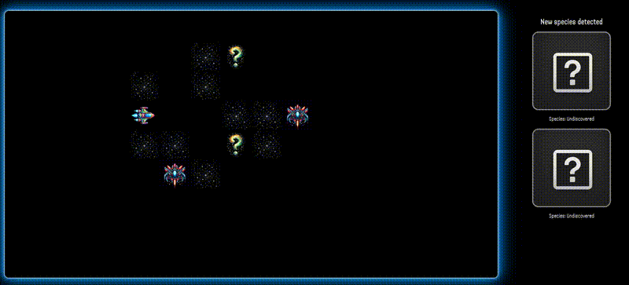

# Close Encounters of the Cute Kind

## Play

[Close Encounters of the Cute Kind](http://sampatt.com/close-encounters-of-the-cute-kind/)

## Description

Close Encounters of the Cute Kind is a JavaScript browser game built in one week as a project for my General Assembly Software Engineering Immersive bootcamp.

You're a space wildlife photographer hunting for cute creatures, while avoiding the dangers of the cosmos!

Growing up I remember playing simple maze adventures games with my Dad in MS-DOS. This game is meant to emulate that style. If you have fond memories of those games too, send me a message and tell me your favorite!

### Technologies used

The game is built with HTML, CSS, and vanilla Javascript. There are no frameworks or libraries used. It's hosted on Github Pages, and I ensured the game assets take up as little space as possible.

All images were generated using DALLE-3 from OpenAI. I used GPT-4 for troubleshooting, and for a few of the more complicated game mechanics, such as fog of war.

The maze is built from a 2d array and uses CSS grid to display. The various encounters the player faces, and creatures they find, will change positions on each playthrough.

Sound credits can be found in the HTML file.

### Future improvements

- Animate the ship movement
- Procedurally generate the levels
  - Currently is one hardcoded maze, but it would be awesome if it had unlimited, unique levels
- AI-generated unique creatures / encounters
  - The creatures, encounters, and images are all pre-determined, but they could be generated dynamically using AI