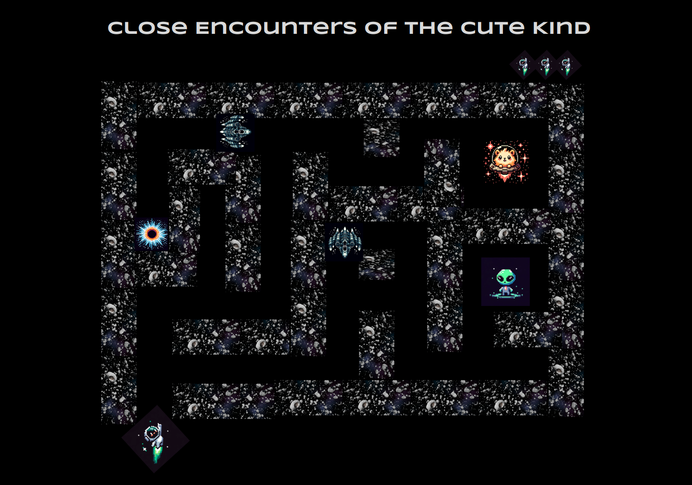

# Close Encounters of the Cute Kind

## Description

This is a maze navigation game. The player controls a space explorer who is searching for and documenting the cutest alien lifeforms in the entire galaxy. Using WASD keyboard controls, the user will move their character through the maze, avoiding the dreaded JoyVoids (who despise cuteness), in order to find the adorable space creatures. If they find them all, they win. If they hit JoyVoids or other obstacles, they lose a life, and eventually the game is over.

## Requirements

1. Maze
2. Player token
3. Enemy tokens / dangerous obstacles
4. Cute Creature tokens
5. Ability to navigate player token through maze and to creatures
6. Win condition
7. Lose life condition and game over condition

## Stretch goals

1. Maze is procedurally generated, allowing unlimited levels
2. Enemies move / fire
3. Player can fire / have special moves
4. "Fog of war" limiting vision to near player
5. Screens with art images displaying intro, win condition, and game over
6. Adding sound

## Pseudocode

### Generate / display the maze

- Create an array of arrays with each value representing a cell of the maze, with differing numerical values for space, walls, and various tokens
  - The arrays will be manually created initially to ensure the maze is usable
- Loop through the array and use the values to assign different CSS classes, create / CSS grid / flexboxes / HTML Table (unsure which is best)

### Navigation

- The player token will be represented by a certain value in the maze array
- attach event listeners for WASD / Arrow keypresses
- check which array value lies in the direction of the keypress
  - if path, swap path and token values in the array (move forward)
  - if wall, ignore input
  - if enemy / obstacle, lose life and replace player token at start
    - or game over if lives are out
  - if cute creature
    - check if all cute creatures are found, 
      - Yes > trigger win condition
      - No > positive visual indicator in UI but game continues

### UI

- Display lives in top corner, hide each when lives lost
- (stretch goal) add click event listeners to intro / win / game over screens to allow users to clear them